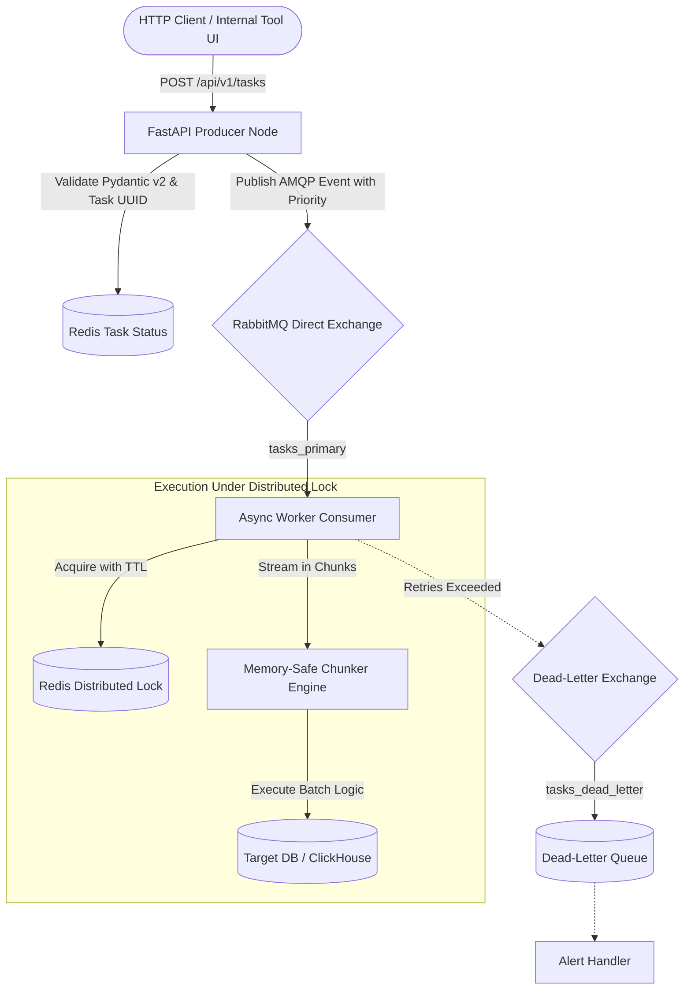

# Async Task Engine

[](https://www.python.org/)
[](https://fastapi.tiangolo.com/)
[](https://www.rabbitmq.com/)
[](https://redis.io/)
[](https://docs.pytest.org/)

Production-grade asynchronous task execution engine designed for internal tools, support operations automation, and high-volume data batch processing

---

## 🎯 Problems This Architecture Solves

1. **Memory Exhaustion on Large Datasets:** Traditional workers often load massive collections directly into memory. This engine implements chunked stream batching, safely handling millions of records with constant memory footprint
2. **Race Conditions & Concurrent Write Collisions:** When multiple operators or automated triggers touch the same resource, collisions happen. Built-in Redis distributed locks with atomic Lua release ensure strict single-task execution per resource key
3. **Poison Messages & Queue Jamming:** Failing tasks are retried with exponential backoff and automatically routed to a Dead-Letter Queue (DLQ) to prevent blocking healthy tasks

---

## 🏗️ Architecture



---

## ⚡ Quickstart

### 1. Run via Docker Compose (Recommended)

Start the complete stack (RabbitMQ, Redis, API, and Worker) in one command:

```bash
docker compose up -d --build
```

- **API Documentation (Swagger):** [http://localhost:8000/docs](http://localhost:8000/docs)
- **RabbitMQ Management UI:** [http://localhost:15672](http://localhost:15672) (guest / guest)
- **Health Check:** `curl http://localhost:8000/health`

### 2. Local Development Setup

```bash
# Clone the repository
git clone git@github.com:georgeladd/async-task-engine.git
cd async-task-engine

# Create and activate virtualenv
python3 -m venv .venv
source .venv/bin/activate

# Install dependencies
pip install -r requirements.dev.txt

# Run full test suite with coverage
pytest -v --cov=src tests/

# Run linter
ruff check src tests
```

---

## 📡 API Usage Example

### Submit a Task

```bash
curl -X POST "http://localhost:8000/api/v1/tasks" \
     -H "Content-Type: application/json" \
     -d '{
       "task_type": "support_data_cleanup",
       "resource_id": "account_49201",
       "priority": "high",
       "payload": {
         "items": [
           {"id": 1, "action": "archive"},
           {"id": 2, "action": "archive"}
         ],
         "parameters": {"batch_tag": "daily_ops"}
       }
     }'
```

Response (`202 Accepted`):
```json
{
  "task_id": "550e8400-e29b-41d4-a716-446655440000",
  "status": "pending",
  "enqueued_at": "2026-09-09T14:30:00Z",
  "message": "Task enqueued successfully for background processing"
}
```

### Query Task Status

```bash
curl "http://localhost:8000/api/v1/tasks/550e8400-e29b-41d4-a716-446655440000"
```

---

## 🧪 Testing Strategy

The repository maintains 100% unit and integration coverage across critical paths:
- **`tests/test_chunker.py`**: Stream slicing, uneven division, and memory generator boundaries
- **`tests/test_redis_lock.py`**: Atomic Lua script release, lock timeout handling, and race condition prevention
- **`tests/test_api.py`**: FastAPI request validation, AMQP mock dispatch, and error handling
- **`tests/test_schemas.py`**: Pydantic v2 serialization integrity

---

## 📄 License

MIT License. Designed by [George Ladd](https://github.com/georgeladd)
