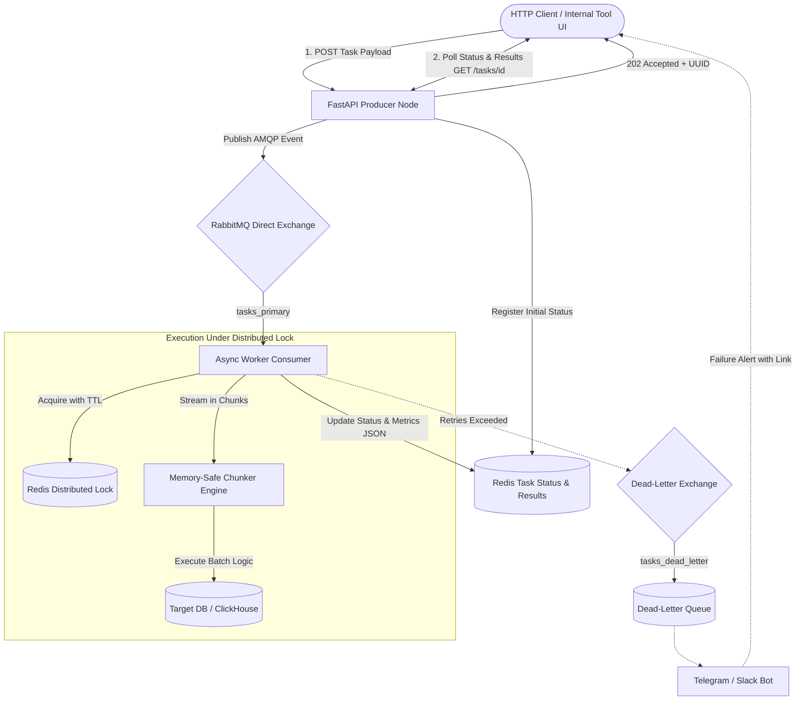

# Async Task Engine

🌐 **[English](README.md)** • **[Русский](README_RU.md)**

[](https://www.python.org/)
[](https://fastapi.tiangolo.com/)
[](https://www.rabbitmq.com/)
[](https://redis.io/)
[](https://github.com/georgeladd/async-task-engine/actions/workflows/ci.yml)
[](https://docs.pytest.org/)
[](http://localhost:8000/dashboard)
[](http://localhost:8000/metrics)
[](docs/ARCHITECTURE.md)
[](docs/SUPPORT_RUNBOOK.md)

Production-grade asynchronous task execution engine designed for internal tools, support operations automation, and high-volume data batch processing

---

## 📚 Technical Documentation

| Document | Target Audience | Key Topics Covered |
|---|---|---|
| **[System Architecture Specification](docs/ARCHITECTURE.md)** | Backend Engineers, Architects | Invariants, AMQP topology, Redis Lua locks, chunked batch streaming, SSRF security, trade-offs |
| **[Support Runbook & Incident Playbook](docs/SUPPORT_RUNBOOK.md)** | L2/L3 Support, Operations, SRE | 5-min onboarding, 30-sec triage checklist, incident matrix & copy-paste CLI fix commands |
| **[Web Console Operator Guide](docs/WEB_CONSOLE_GUIDE.md)** | Support Engineers, Operators | Live charts, lock removal, self-service task runner, DLQ triage, incident dossier workflow |

---

## 🎯 Problems This Architecture Solves

1. **Memory Pressure on Large Payloads:** Legacy workers parse and duplicate full datasets in memory. This engine implements generator-based chunking (`chunk_iterator`), eliminating intermediate list copies and reducing Python GC pressure during bulk data processing
2. **Race Conditions & Write Collisions:** When concurrent users or background jobs update the same account, state corrupts. Redis distributed locks with Lua-based atomic token validation guarantee sequential execution per resource key
3. **Poison Messages & Queue Jamming:** Failing tasks are tracked via durable Redis attempt counters and automatically routed to a Dead-Letter Queue (DLQ) after retry exhaustion to prevent blocking healthy tasks
4. **Network Retries & Duplicate Execution (Idempotency):** Built-in atomic `SET NX` support for the `Idempotency-Key` HTTP header and JSON body token prevents duplicate queuing even under high-concurrency race conditions; subsequent requests with identical tokens atomically retrieve the original task without redundant broker dispatch or double-execution
5. **Downstream API & Database Overload (Throttling):** Integrated Token Bucket rate limiter controls processing cadence, protecting external endpoints and database connection pools from starvation during multi-thousand item batch execution
6. **Inefficient Status Polling (Secure Webhook Callbacks):** Optional `callback_url` parameter enables event-driven HTTP push notifications for both successful completions and dead-letter escalations; outgoing deliveries are hardened with SSRF IP filtering and cryptographic HMAC-SHA256 signatures (`X-Hub-Signature-256`)

---

## 🏗️ Architecture



---

## ⚡ Quickstart

### 1. Run via Docker Compose (Recommended)

Start the complete stack (RabbitMQ, Redis, API, and Worker) in one command:

```bash
docker compose up -d --build
```

- **Operations & Support Console:** [http://localhost:8000/dashboard](http://localhost:8000/dashboard)
- **API Documentation (Swagger):** [http://localhost:8000/docs](http://localhost:8000/docs)
- **Prometheus Telemetry:** [http://localhost:8000/metrics](http://localhost:8000/metrics)
- **RabbitMQ Management UI:** [http://localhost:15672](http://localhost:15672) (guest / guest)
- **Health Check:** `curl http://localhost:8000/health`

### 2. Local Development Setup

```bash
# Clone the repository
git clone git@github.com:georgeladd/async-task-engine.git
cd async-task-engine

# Create and activate virtualenv
python3 -m venv .venv
source .venv/bin/activate

# Install dependencies
pip install -r requirements.dev.txt

# Run full test suite with coverage
pytest -v --cov=src tests/

# Run linter
ruff check src tests
```

---

## 🖥️ Operations & Support Web Console

The engine features a built-in, lightweight web console for L2/L3 support and on-call engineers, accessible at **`http://localhost:8000/dashboard`**:

- **Real-Time Health Monitoring:** Pulsing indicators for API, RabbitMQ, Redis, and in-flight workers
- **Interactive Telemetry Graphs:** Real-time throughput, queue backlog trends, and batch duration percentiles powered by Prometheus instruments
- **One-Click Distributed Lock Clearance:** Inspect active Redis resource locks with live TTL countdown and force-release stuck locks instantly without terminal access
- **Dead-Letter Queue (DLQ) Incident Triage:** Inspect failing payloads, replay failed messages back to the primary queue, or auto-generate complete Incident Dossiers for L3/Development bug trackers
- **Self-Service Task Runner:** Trigger operational cleanup or synchronization jobs directly from the browser with instant progress feedback

---

## 🛠️ Operations & Support CLI

A dedicated command-line utility for L2/L3 support and operations automation:

```bash
# Check service connectivity and status
python -m src.cli health

# Submit task directly from terminal
python -m src.cli submit --type data_cleanup --resource tenant_42 --priority high --items 100

# Query task execution progress and result metrics
python -m src.cli status 550e8400-e29b-41d4-a716-446655440000

# Inspect all active distributed locks in Redis
python -m src.cli locks

# Manually release an orphaned or stuck resource lock
python -m src.cli unlock tenant_42
```

---

## 📡 API Usage Example

### Submit a Task

```bash
curl -X POST "http://localhost:8000/api/v1/tasks" \
     -H "Content-Type: application/json" \
     -H "Idempotency-Key: ops-task-49201-run1" \
     -d '{
       "task_type": "support_data_cleanup",
       "resource_id": "account_49201",
       "priority": "high",
       "callback_url": "https://ops.corp/webhook/task-completed",
       "payload": {
         "items": [
           {"id": 1, "action": "archive"},
           {"id": 2, "action": "archive"}
         ],
         "parameters": {"batch_tag": "daily_ops"}
       }
     }'
```

Response (`202 Accepted`):
```json
{
  "task_id": "550e8400-e29b-41d4-a716-446655440000",
  "status": "pending",
  "is_duplicate": false,
  "enqueued_at": "2026-09-09T14:30:00Z",
  "message": "Task enqueued successfully for background processing"
}
```

### Query Task Status

```bash
curl "http://localhost:8000/api/v1/tasks/550e8400-e29b-41d4-a716-446655440000"
```

---

## 🧪 Testing Strategy

The repository maintains 100% unit and integration coverage across 49 test cases:
- **`tests/test_chunker.py`**: Stream slicing, uneven division, and memory generator boundaries
- **`tests/test_redis_lock.py`**: Atomic Lua script release, lock timeout handling, and race condition prevention
- **`tests/test_api.py`**: FastAPI request validation, AMQP mock dispatch, and error handling
- **`tests/test_idempotency.py`**: Duplicate request suppression, Redis TTL caching, header & body token parity, and queue isolation
- **`tests/test_logging.py`**: Structured JSON formatter schema, contextvars correlation propagation, and exception serialization
- **`tests/test_rate_limiter.py`**: Token Bucket capacity bursts, deficit sleep enforcement, non-blocking try_acquire, and worker pacing
- **`tests/test_webhooks.py`**: Asynchronous webhook notification delivery, status schema validation, and HTTP failure isolation
- **`tests/test_cli.py`**: Support CLI subcommands, health checks, argument parsing, and lock clearance
- **`tests/test_metrics.py`**: Prometheus gauges, counters, histograms, and `/metrics` exposition format
- **`tests/test_ops_api.py`**: Dashboard HTML serving, aggregated overview telemetry, distributed locks management, DLQ inspection, task replay, and incident escalation dossier generation
- **`tests/test_schemas.py`**: Pydantic v2 serialization integrity

---

## 📄 License

MIT License. Designed by [George Ladd](https://github.com/georgeladd)
