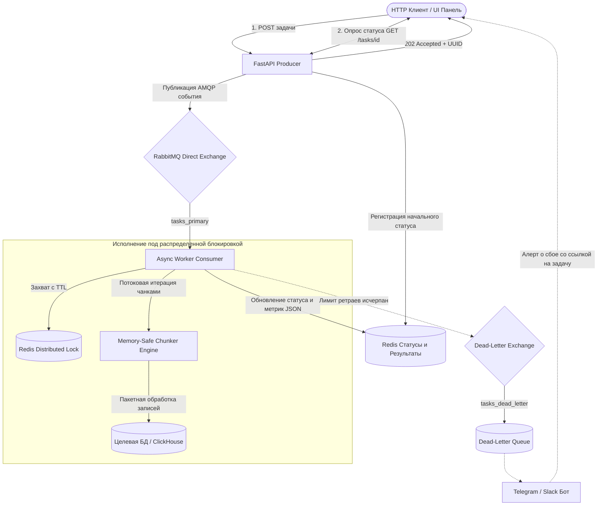

# Async Task Engine

🌐 **[English](README.md)** • **[Русский](README_RU.md)**

[](https://www.python.org/)
[](https://fastapi.tiangolo.com/)
[](https://www.rabbitmq.com/)
[](https://redis.io/)
[](https://github.com/georgeladd/async-task-engine/actions/workflows/ci.yml)
[](https://docs.pytest.org/)
[](http://localhost:8000/dashboard)
[](http://localhost:8000/metrics)
[](docs/ARCHITECTURE_RU.md)
[](docs/SUPPORT_RUNBOOK_RU.md)

Отказоустойчивый асинхронный движок пакетной обработки задач и автоматизации рутинных операций для команд разработки и технической поддержки

---

## 📚 Техническая документация

| Документ | Для кого | Ключевые темы |
|---|---|---|
| **[Спецификация архитектуры системы](docs/ARCHITECTURE_RU.md)** | Backend-разработчики, архитекторы | Архитектурные инварианты, топология AMQP, блокировки Redis на Lua, потоковая чанковая обработка, компромиссы (trade-offs) |
| **[Регламент поддержки и устранения аварий](docs/SUPPORT_RUNBOOK_RU.md)** | Инженеры L2/L3 поддержки, SRE, дежурные | 5-минутный онбординг, 30-секундный экспресс-чеклист диагностики, матрица инцидентов, рецепты исправления через UI и CLI |
| **[Руководство оператора по веб-консоли](docs/WEB_CONSOLE_GUIDE_RU.md)** | Специалисты поддержки, операторы | Графики в реальном времени, снятие блокировок, Task Runner, разбор DLQ, формирование досье аварии |

---

## 🎯 Какие проблемы решает эта архитектура

1. **Переполнение оперативной памяти (OOM) на больших объемах:** Классические воркеры часто загружают массивы данных целиком в память. В этом движке реализована потоковая генераторная обработка чанками (chunked streaming), гарантирующая константное потребление памяти даже на миллионах строк
2. **Состояния гонки (Race Conditions) и коллизии записей:** Когда несколько операторов или фоновых скриптов одновременно запускают обновление одной и той же сущности, возникают конфликты. Встроенные распределенные блокировки Redis с атомарным снятием через Lua-скрипт гарантируют строго последовательную обработку в разрезе ресурса
3. **Зависание очередей из-за "ядовитых" сообщений (Poison Pills):** Задачи с фатальными ошибками ретраятся с экспоненциальной задержкой и автоматически изолируются в Dead-Letter Queue (DLQ), не блокируя здоровый поток очереди
4. **Сбои сети и дублирование задач (Идемпотентность):** Встроенная поддержка HTTP-заголовка `Idempotency-Key` и токенов в теле запроса. Повторные отправки с тем же ключом возвращают исходную задачу без дублирования в брокере и повторных вызовов
5. **Перегрузка внешних API и исчерпание пула БД (Throttling):** Встроенный асинхронный Token Bucket rate limiter дозирует скорость потоковой обработки чанков, защищая сторонние сервисы и базы данных от перегрузки
6. **Паразитный опрос статуса через Polling (Вебхуки):** Опциональный параметр `callback_url` позволяет отправлять событийно-ориентированные HTTP push-уведомления об успешном завершении или ошибках в DLQ, избавляя клиентов от постоянных GET-опросов

---

## 🏗️ Архитектура



---

## ⚡ Быстрый старт

### 1. Запуск через Docker Compose (Рекомендуется)

Запуск полного стека (RabbitMQ, Redis, API и Worker) одной командой:

```bash
docker compose up -d --build
```

- **Панель управления для поддержки (Dashboard):** [http://localhost:8000/dashboard](http://localhost:8000/dashboard)
- **Интерактивная документация API (Swagger):** [http://localhost:8000/docs](http://localhost:8000/docs)
- **Метрики Prometheus:** [http://localhost:8000/metrics](http://localhost:8000/metrics)
- **Панель управления RabbitMQ:** [http://localhost:15672](http://localhost:15672) (логин: `guest`, пароль: `guest`)
- **Проверка здоровья (Health Check):** `curl http://localhost:8000/health`

### 2. Локальное окружение для разработки

```bash
# Клонирование репозитория
git clone git@github.com:georgeladd/async-task-engine.git
cd async-task-engine

# Создание и активация виртуального окружения
python3 -m venv .venv
source .venv/bin/activate

# Установка зависимостей
pip install -r requirements.dev.txt

# Запуск полного набора тестов с анализом покрытия
pytest -v --cov=src tests/

# Запуск линтера
ruff check src tests
```

---

## 🖥️ Веб-консоль управления для техподдержки

В движок встроена легковесная веб-панель для дежурных инженеров поддержки L2/L3, доступная по адресу **`http://localhost:8000/dashboard`**:

- **Мониторинг состояния сервисов:** Пульсирующие индикаторы доступности API, RabbitMQ, Redis и количества воркеров в реальном времени
- **Интерактивные графики телеметрии:** Динамика пропускной способности (Throughput), рост очереди задач и распределение задержек выполнения батчей на базе метрик Prometheus
- **Снятие распределенных блокировок в один клик:** Таблица активных локов в Redis с обратным отсчетом секунд до авто-экспирации и кнопкой принудительного снятия зависших блокировок без необходимости заходить в терминал
- **Разбор и восстановление сбоев (DLQ):** Просмотр причин падения задач, кнопка повторной отправки (Replay) в основную очередь и кнопка эскалации с авто-генерацией отчета инцидента для разработчиков L3
- **Запуск сценариев самообслуживания (Self-Service):** Форма для дежурных операторов для ручного запуска типовых сценариев очистки и синхронизации с live-индикатором выполнения

---

## 🛠️ Консольная утилита поддержки (Ops CLI)

Специализированная консольная утилита для быстрой диагностики и автоматизации рутинных процедур:

```bash
# Проверка сетевой связности и состояния сервиса
python -m src.cli health

# Отправка задачи напрямую из терминала
python -m src.cli submit --type data_cleanup --resource tenant_42 --priority high --items 100

# Запрос прогресса выполнения и метрик задачи
python -m src.cli status 550e8400-e29b-41d4-a716-446655440000

# Просмотр всех активных распределенных блокировок в Redis
python -m src.cli locks

# Ручное снятие зависшей блокировки ресурса
python -m src.cli unlock tenant_42
```

---

## 📡 Примеры использования API

### Отправка задачи на обработку

```bash
curl -X POST "http://localhost:8000/api/v1/tasks" \
     -H "Content-Type: application/json" \
     -H "Idempotency-Key: ops-task-49201-run1" \
     -d '{
       "task_type": "support_data_cleanup",
       "resource_id": "account_49201",
       "priority": "high",
       "callback_url": "https://ops.corp/webhook/task-completed",
       "payload": {
         "items": [
           {"id": 1, "action": "archive"},
           {"id": 2, "action": "archive"}
         ],
         "parameters": {"batch_tag": "daily_ops"}
       }
     }'
```

Ответ (`202 Accepted`):
```json
{
  "task_id": "550e8400-e29b-41d4-a716-446655440000",
  "status": "pending",
  "is_duplicate": false,
  "enqueued_at": "2026-09-09T14:30:00Z",
  "message": "Task enqueued successfully for background processing"
}
```

### Запрос статуса и результатов задачи

```bash
curl "http://localhost:8000/api/v1/tasks/550e8400-e29b-41d4-a716-446655440000"
```

---

## 🧪 Стратегия тестирования

Проект покрыт 49 автоматическими тестами, валидирующими критические пути исполнения:
- **`tests/test_chunker.py`**: Потоковое разбиение на чанки, обработка неровных остатков и границы памяти генераторов
- **`tests/test_redis_lock.py`**: Атомарное снятие блокировки через Lua-скрипт, обработка тайм-аутов и предотвращение гонок
- **`tests/test_api.py`**: Валидация входных схем FastAPI, отправка в брокер очередей и обработка ошибок
- **`tests/test_idempotency.py`**: Подавление повторных отправок, TTL-кэш в Redis, паритет заголовка и тела запроса, изоляция очереди RabbitMQ
- **`tests/test_logging.py`**: Схема структурированного JSON-форматтера, проброс correlation_id через contextvars и сериализация исключений
- **`tests/test_rate_limiter.py`**: Всплески емкости Token Bucket, сон при дефиците токенов, неблокирующий try_acquire и темп воркера
- **`tests/test_webhooks.py`**: Асинхронная доставка HTTP вебхуков, валидация схемы событий и изоляция сетевых сбоев
- **`tests/test_cli.py`**: Проверка команд консольной утилиты саппорта, парсинг аргументов и снятие локов
- **`tests/test_metrics.py`**: Счетчики, гистограммы задержек и формат отдачи метрик `/metrics` для Prometheus
- **`tests/test_ops_api.py`**: Раздача веб-консоли, эндпоинты агрегации метрик, инспекция локов, Replay из DLQ и генерация отчетов инцидентов
- **`tests/test_schemas.py`**: Корректность строгой сериализации схем Pydantic v2

---

## 📄 Лицензия

MIT License. Автор проекта: [George Ladd](https://github.com/georgeladd)
