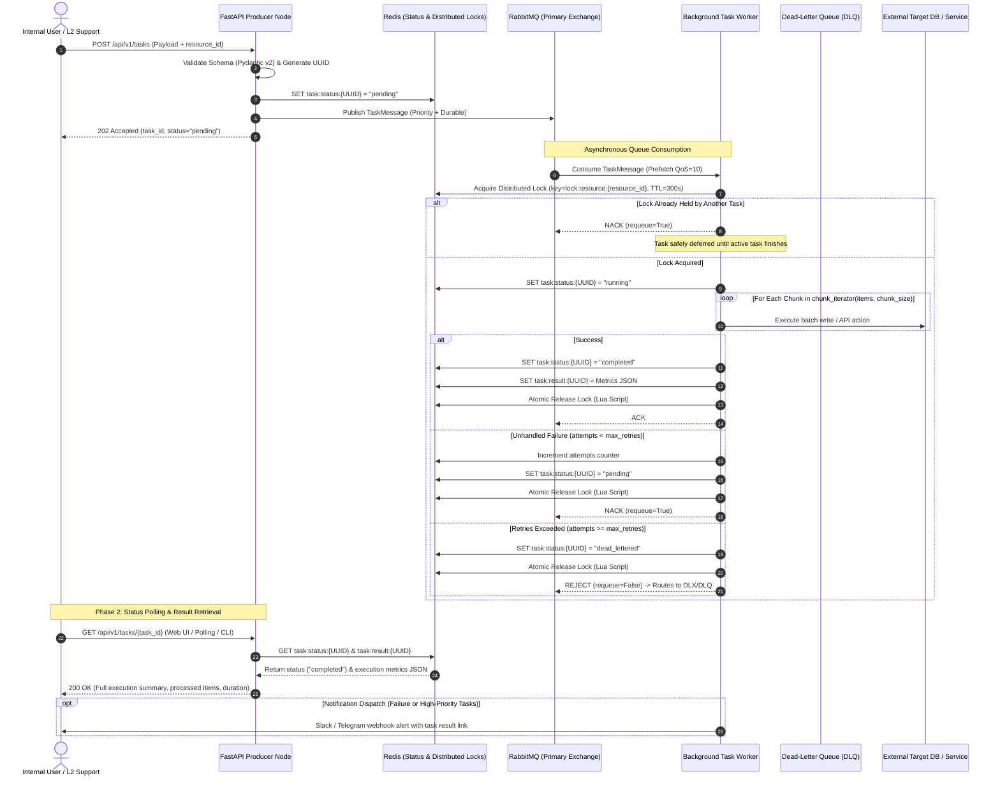

# System Architecture Specification

🌐 **[English](ARCHITECTURE.md)** • **[Русский](ARCHITECTURE_RU.md)**

This document details the architectural design, core invariants, data flow models, and technical trade-offs implemented in **Async Task Engine**

---

## 1. Architectural Goals & Core Principles

The engine is purpose-built for operational automation and internal tooling platforms. It adheres to four key engineering principles:

1. **Decoupled Asynchronous Execution:** Web APIs must never block on long-running tasks. Requests are validated, assigned a UUID, and queued with an immediate `202 Accepted` response
2. **Memory-Bounded Streaming (Chunking):** Workloads containing hundreds of thousands or millions of records must not saturate RAM. Processing is strictly executed via chunked generator streams with constant `O(1)` memory overhead
3. **Distributed Concurrency Control:** Operations targeting the same state or external system must execute sequentially. Fine-grained resource locks prevent write collisions and race conditions across multiple worker nodes
4. **Resilient Failure Routing:** Failed tasks are retried with attempt tracking. Persistent failures are segregated into a Dead-Letter Queue (DLQ) to prevent queue head-of-line blocking

---

## 2. Component Topology & Data Flow



---

## 3. Subsystem Breakdown

### 3.1. Producer Layer (`src/api.py`)
- Built on **FastAPI** with native asynchronous request handling
- Validates task payload constraints via **Pydantic v2** (`src/schemas.py`)
- Emits tasks into RabbitMQ direct exchange using `aio-pika` connection pooling
- Fast response SLA: request acceptance typically takes under 15ms

### 3.2. Queue Broker & Topology (`src/broker.py`)
- **Direct Exchange (`tasks.direct`):** Routes incoming tasks by routing key `task.process`
- **Primary Queue (`tasks_primary`):** Configured with `x-max-priority=10` (supports priority levels `low`, `normal`, `high`, `critical`) and `x-dead-letter-exchange=tasks.dlx`
- **Dead-Letter Exchange (`tasks.dlx`) & Queue (`tasks_dead_letter`):** Catches unprocessable, malformed, or permanently failing tasks for manual inspection and alerts

### 3.3. Distributed Lock Manager (`src/redis_lock.py`)
- Guards against concurrent execution on identical target entities (`resource_id`)
- Uses `SET lock:resource:{key} {token} NX EX {ttl}` to guarantee atomic acquisition
- Safe atomic release using Lua scripting:

```lua
if redis.call("get", KEYS[1]) == ARGV[1] then
    return redis.call("del", KEYS[1])
else
    return 0
end
```
*Why this matters:* If a task executes longer than the TTL, the lock naturally expires. When the original task finally completes, the Lua script verifies ownership before deleting, preventing the worker from accidentally releasing another worker's new lock

### 3.4. Chunked Batch Engine (`src/chunker.py`)
- Yields fixed-size batch lists through generator iterators
- Eliminates Python list slice copies and high garbage-collection pauses
- Enables steady continuous throughput during bulk updates and migrations

### 3.5. Worker Node (`src/worker.py`)
- Asynchronous loop using `aio-pika` with explicit manual message acknowledgment (`ack`, `nack`, `reject`)
- Implements `signal.SIGINT` and `signal.SIGTERM` listeners for clean in-flight task draining before container termination

### 3.6. Result Retrieval & Operator Feedback Loop
- **REST Status Endpoint:** Operators inspect in-flight or completed runs via `GET /api/v1/tasks/{task_id}`
- **Fast Key-Value Storage:** Worker writes completion metrics into Redis (`task:result:{task_id}`) containing `TaskResult` (status, processed items, chunk count, duration in seconds, error traceback)
- **Web UI & Polling Integration:** Internal portals poll this endpoint until status transitions from `RUNNING` to `COMPLETED` or `FAILED`, presenting live progress bars
- **Proactive Alerts:** Critical failures and dead-letter routing emit webhook notifications (Slack, Telegram) directly mentioning the on-call engineer

### 3.7. Observability & Telemetry Subsystem (`src/metrics.py`)
- **Scrape Endpoint:** Standard `/metrics` handler exposing metrics in Prometheus text exposition format
- **Throughput Counters:** `tasks_submitted_total` and `tasks_completed_total` labeled by `task_type`, `priority`, and final `status`
- **Latency Distribution:** `task_duration_seconds` histogram providing p50, p95, and p99 percentiles for batch processing operations
- **Stream Metrics:** `items_processed_total` records granular throughput of individual chunk elements
- **Queue Health & Alarms:** `dead_letter_tasks_total` and `active_worker_tasks` gauge for alerting on worker stall or backlog surge
- **Automated Validation:** GitHub Actions CI validates test coverage and PEP8 compliance on every push across Python 3.11 and 3.12

### 3.8. Operations & Support Web Console (`src/static/`, `src/ops_api.py`)
- **Single-Page Architecture:** Built with Vanilla HTML5/CSS/JS and Chart.js served directly by FastAPI without Node.js build steps or extra containers
- **Single Source of Truth:** Aggregates telemetry via `GET /api/v1/ops/overview` directly reading from Prometheus instruments and Redis keys in real-time
- **Active Lock Clearance:** Inspects active locks and issues atomic evictions via `POST /api/v1/ops/unlock`
- **Two-Way DLQ Integration:** Inspects failure stack traces and provides one-click `POST /api/v1/ops/dlq/replay` to re-enqueue messages back into the primary exchange
- **Structured Incident Dossier:** `POST /api/v1/ops/escalate` automatically collates execution traces, parameters, and queue states into standardized Markdown reports for L3/Dev bug trackers

### 3.9. Idempotency & Deduplication Subsystem (`src/schemas.py`, `src/api.py`)
- **The Problem:** In distributed environments, network blips, operator double-clicks, and client-side retries frequently trigger duplicate task dispatch. Without deduplication, this causes redundant database writes, resource waste, and billing discrepancies
- **Dual Intake Support:** The API inspects the standard HTTP header `Idempotency-Key` as well as the JSON body field `idempotency_key`
- **Atomic Cache Pattern:** When a request with an idempotency key arrives, the producer checks Redis key `idempotency:{token}`:
  - **Cache Hit (Duplicate Request):** The producer suppresses dispatch to RabbitMQ, logs the deduplication event, and returns a `TaskResponse` containing the original `task_id` with `is_duplicate: true`
  - **Cache Miss (New Request):** A new `TaskMessage` is generated and published to RabbitMQ. The mapping `idempotency:{token} -> task_id` is atomically registered in Redis with a 24-hour TTL (`ex=86400`)
- **Broker Protection:** Downstream RabbitMQ queues and background workers remain completely insulated from redundant network retries

### 3.10. Structured JSON Logging & Distributed Tracing (`src/logging_config.py`)
- **Single-Line JSON Schema:** All log entries are formatted as parseable JSON objects containing `timestamp` (UTC ISO-8601), `level`, `logger`, `message`, and execution context
- **Cross-Service Propagation:** The Task UUID is injected into AMQP message properties (`correlation_id`) and message headers (`headers["correlation_id"]`), preserving trace continuity across network boundaries
- **Async Context Isolation:** Python `contextvars.ContextVar` (`current_correlation_id`, `current_resource_id`) transparently attach tracing metadata to all logs emitted within worker coroutines without manual parameter passing
- **Ingestion-Ready:** Tailored for effortless aggregation into Grafana Loki, Elasticsearch, or AWS CloudWatch without complex regex parsing rules

---

## 4. Architectural Trade-Offs & Decisions

| Decision | Chosen Approach | Alternative Considered | Trade-off / Rationale |
|---|---|---|---|
| **Message Broker** | RabbitMQ (`aio-pika`) | Apache Kafka, Celery | RabbitMQ provides granular message acknowledgments, built-in DLQ routing, and message prioritization out-of-the-box without Celery's overhead |
| **Concurrency Control** | Redis Distributed Lock | Database Row-Level Locking (`SELECT FOR UPDATE`) | Decouples locking from the relational database connection pool, eliminating database lock contention during long operations |
| **Idempotency Deduplication** | Redis TTL Cache (`idempotency:*`) | Database Unique Constraint Tables | Redis provides sub-millisecond atomic key validation without incurring relational database IOPS overhead on duplicate bursts |
| **Batch Streaming** | Memory-Safe Generator Iterators | Loading full arrays, Pandas DataFrames | Generators ensure predictable memory utilization regardless of payload size |
| **Task Requeuing** | NACK with Requeue & Retry Limits | Infinite immediate retries | Prevents "poison pill" messages from crashing worker loops indefinitely |
