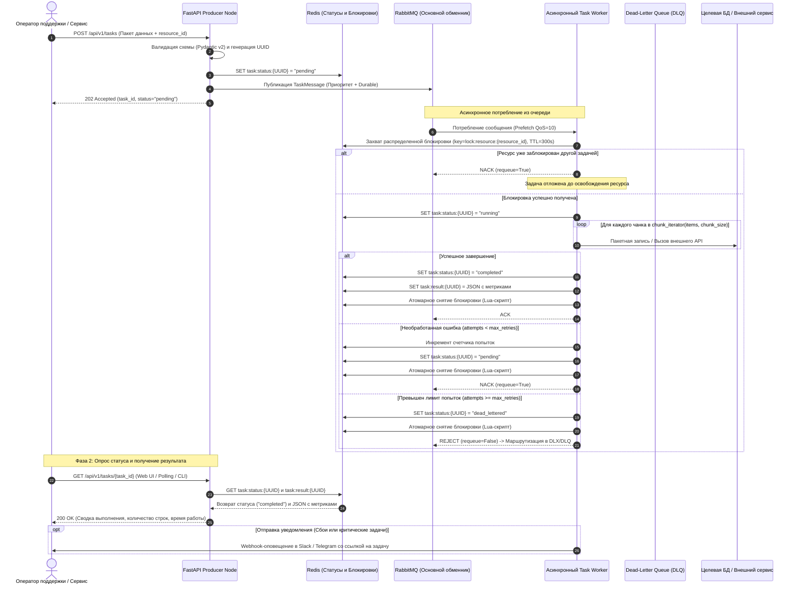

# Спецификация архитектуры системы

🌐 **[English](ARCHITECTURE.md)** • **[Русский](ARCHITECTURE_RU.md)**

В этом документе детально описаны архитектурные решения, ключевые инварианты, модели движения данных и технические компромиссы (trade-offs), реализованные в **Async Task Engine**

---

## 1. Архитектурные цели и ключевые принципы

Движок спроектирован для автоматизации операционной деятельности и внутренних платформ поддержки. Архитектура базируется на четырех ключевых инженерных принципах:

1. **Изолированное асинхронное исполнение:** Web API никогда не должен блокироваться на длительных задачах. Запросы валидируются, получают уникальный UUID, ставятся в очередь и моментально возвращают клиенту статус `202 Accepted`
2. **Генераторная чанковая обработка:** Пакетные нагрузки не должны приводить к нехватке памяти или паузам сборщика мусора. Обработка данных выполняется генератором (`chunk_iterator`), что исключает дублирование списков в оперативной памяти с учетом лимитов размера сообщений брокера
3. **Распределенный контроль конкурентности:** Операции, затрагивающие одну и ту же учетную запись или ресурс, должны выполняться строго последовательно. Гранулярные блокировки ресурсов исключают коллизии записей и гонки между несколькими воркерами
4. **Отказоустойчивая маршрутизация сбоев:** Сбойные задачи повторяются с учетом счетчика попыток. Задачи с неустранимыми ошибками изолируются в Dead-Letter Queue (DLQ), не блокируя обработку здоровых сообщений

---

## 2. Топология компонентов и поток данных



---

## 3. Детализация подсистем

### 3.1. Уровень продюсера (`src/api.py`)
- Построен на базе **FastAPI** с нативной асинхронной обработкой запросов
- Валидация входных структур выполняется через **Pydantic v2** (`src/schemas.py`)
- Публикация задач в direct exchange RabbitMQ с пулом соединений через `aio-pika`
- Жесткий SLA по времени ответа: прием задачи и постановка в очередь занимает менее 15 мс

### 3.2. Брокер очередей и топология AMQP (`src/broker.py`)
- **Direct Exchange (`tasks.direct`):** Маршрутизирует входящие задачи по ключу `task.process`
- **Основная очередь (`tasks_primary`):** Сконфигурирована с поддержкой приоритетов `x-max-priority=10` (уровни `low`, `normal`, `high`, `critical`) и параметром `x-dead-letter-exchange=tasks.dlx`
- **Dead-Letter Exchange (`tasks.dlx`) и очередь (`tasks_dead_letter`):** Перехватывают поврежденные сообщения и задачи с исчерпанными попытками для ручного разбора дежурным инженером

### 3.3. Менеджер распределенных блокировок (`src/redis_lock.py`)
- Защищает от параллельного исполнения задач над одним и тем же ресурсом (`resource_id`)
- Использует атомарную команду `SET lock:resource:{key} {token} NX EX {ttl}`
- Безопасное снятие блокировки с верификацией владельца через атомарный Lua-скрипт:

```lua
if redis.call("get", KEYS[1]) == ARGV[1] then
    return redis.call("del", KEYS[1])
else
    return 0
end
```
*Почему это важно:* Если задача выполнялась дольше назначенного TTL, блокировка автоматически снимется по тайм-ауту. Когда зависшая задача наконец завершится, скрипт на Lua проверит совпадение токена и не позволит случайно снять чужой новый лок, захваченный другим воркером

### 3.4. Движок потоковой обработки чанками (`src/chunker.py`)
- Отдает фиксированные срезы данных через генераторные итераторы
- Исключает копирование списков в памяти Python и устраняет длинные паузы сборщика мусора (GC)
- Обеспечивает стабильную пропускную способность при миграциях и пакетных обновлениях

### 3.5. Узел воркера (`src/worker.py`)
- Асинхронный цикл на базе `aio-pika` с ручным подтверждением обработки сообщений (`ack`, `nack`, `reject`)
- **Персистентный Redis Attempt Tracker:** В отличие от счетчиков в памяти процесса, которые сбрасываются при AMQP `nack(requeue=True)`, число попыток атомарно учитывается в Redis командой `INCR task:attempts:{task_id}`. При достижении `max_task_retries` (по умолчанию: 3) воркер отвергает сообщение без возврата в очередь (`reject(requeue=False)`), маршрутизируя его в Dead-Letter Queue (DLQ) и обновляя статус задачи в `DEAD_LETTERED`
- Перехват сигналов `signal.SIGINT` и `signal.SIGTERM` для корректного завершения активных задач перед остановкой контейнера (graceful shutdown)

### 3.6. Получение результатов и обратная связь для оператора
- **REST эндпоинт статуса:** Операторы опрашивают прогресс через `GET /api/v1/tasks/{task_id}`
- **Быстрое хранение состояния:** Воркер записывает метрики завершения в Redis (`task:result:{task_id}`), включая объект `TaskResult` (статус, обработанные элементы, количество чанков, время в секундах, стек ошибки)
- **Интеграция с Web UI:** Внутренние интерфейсы опрашивают статус до перехода в `COMPLETED` или `FAILED`, отображая live-прогресс
- **Проактивные алерты:** При фатальных сбоях отправляется webhook-сообщение в каналы дежурной смены (Telegram, Slack) с тегом инженера

### 3.7. Подсистема наблюдаемости и метрик (`src/metrics.py`)
- **Эндпоинт метрик:** Стандартный хэндлер `/metrics` в формате Prometheus exposition text
- **Счетчики пропускной способности:** `tasks_submitted_total` и `tasks_completed_total` с лейблами `task_type`, `priority` и `status`
- **Распределение задержек:** Гистограмма `task_duration_seconds` для расчета перцентилей p50, p95 и p99
- **Потоковые метрики:** `items_processed_total` отслеживает гранулярную скорость обработки отдельных строк
- **Здоровье очередей:** Метрика `dead_letter_tasks_total` и gauge `active_worker_tasks` для детекции зависания воркеров
- **Межпроцессная кластерная телеметрия:** Оперативные показатели кластера (`metrics:tasks_completed`, `metrics:items_processed`, `metrics:active_workers`, `metrics:tasks_dead_letter`) синхронизируются через общие атомарные счетчики в Redis, гарантируя консистентность дашборда поддержки при любом числе реплик воркеров
- **CI/CD валидация:** GitHub Actions CI автоматически запускает тесты и проверку линтером на Python 3.11 и 3.12 при каждом push и PR

### 3.8. Веб-консоль управления для техподдержки (`src/static/`, `src/ops_api.py`)
- **Архитектура Single-Page:** Интерфейс на чистом Vanilla HTML5/CSS/JS с библиотекой Chart.js раздается напрямую из FastAPI без утяжеления сборками Node.js
- **Безопасность и авторизация операций:** Все операционные эндпоинты (`/api/v1/ops/*`) защищены обязательной проверкой токена `X-Ops-Token` (`OPS_API_KEY`), исключая неавторизованные вмешательства в работу очередей и снятие блокировок
- **Единый источник правды и неблокирующий I/O:** Эндпоинт `GET /api/v1/ops/overview` считывает кластерные счетчики Redis за O(1) и выполняет курсорный обход `scan_iter`, полностью исключая блокирующие вызовы `KEYS`
- **Снятие зависших блокировок:** Инспекция активных локов с обратным отсчетом секунд и принудительным снятием через `POST /api/v1/ops/unlock`
- **Двусторонняя интеграция с DLQ и Replay с сохранением контекста:** Просмотр стектрейсов ошибок и запуск повторного исполнения через `POST /api/v1/ops/dlq/replay`; система восстанавливает исходный payload из сохраненного контекста `task:data:{task_id}`, обнуляет счетчик попыток, декрементирует метрику DLQ и отправляет задачу в первичный обменник с высоким приоритетом
- **Генерация отчетов об авариях:** Эндпоинт `POST /api/v1/ops/escalate` формирует структурированный Markdown-отчет (Incident Dossier) со всеми техническими параметрами для тикет-систем разработчиков; доступен как глобально через кнопку в шапке, так и контекстно из таблицы DLQ
- **Отдельное руководство оператора:** Подробное интерактивное описание панелей, графиков и процедур приведено в [Руководстве по веб-консоли управления](WEB_CONSOLE_GUIDE_RU.md)

### 3.9. Подсистема идемпотентности и дедупликации (`src/schemas.py`, `src/api.py`)
- **Проблема в распределенной среде:** Нестабильность сети, повторные клики операторов и автоматические ретраи клиентов регулярно приводят к дублированию задач. Без дедупликации это вызывает повторные списания, двойную обработку записей и перегрузку воркеров
- **Два способа передачи ключа:** API поддерживает как стандартный HTTP-заголовок `Idempotency-Key`, так и поле в JSON-теле запроса `idempotency_key`
- **Атомарная фиксация через SET NX:** Захват токена идемпотентности происходит через атомарную команду `SET idempotency:{token} {task_id} NX EX 86400` *до* отправки сообщения в брокер, что полностью исключает состояния гонки (TOCTOU):
  - **Попадание в кэш (Дубликат):** Продюсер блокирует отправку в RabbitMQ, считывает актуальный статус задачи из Redis, логирует дедупликацию и возвращает исходный `task_id` с флагом `is_duplicate: true`
  - **Промах кэша (Новый запрос):** Задача публикуется в очередь. При сетевом сбое брокера токен удаляется для возможности безопасного повтора клиентом
- **Защита нижележащих уровней:** Очереди RabbitMQ и фоновые воркеры полностью изолированы от дублирующей нагрузки

### 3.10. Структурированное JSON-логирование и сквозная трассировка (`src/logging_config.py`)
- **Единая схема JSON:** Каждая строка логов формируется как валидный JSON-объект с полями `timestamp` (UTC ISO-8601), `level`, `logger`, `message` и контекстными метаданными
- **Межсервисный проброс контекста:** Идентификатор задачи (Task UUID) инжектируется в свойства AMQP-сообщения (`correlation_id`) и заголовки (`headers["correlation_id"]`), сохраняя непрерывность трейса через сетевые границы
- **Изоляция асинхронного контекста:** Использование Python `contextvars.ContextVar` (`current_correlation_id`, `current_resource_id`) позволяет автоматически прикреплять метаданные ко всем логам внутри корутин воркера без ручной передачи параметров
- **Готовность к инжесту в ELK/Loki:** Логи готовы для моментального сбора и фильтрации в Grafana Loki, OpenSearch или Elasticsearch без необходимости писать сложные regex-правила парсинга

### 3.11. Подсистема ограничения скорости Token Bucket (`src/rate_limiter.py`)
- **Защита внешней инфраструктуры:** Массовая обработка тысяч строк может исчерпать лимиты сторонних API или вызвать дефицит пула подключений к реляционной БД. Движок реализует внутрипроцессный асинхронный Token Bucket ограничитель
- **Монотонное пополнение токенов:** Запас токенов пополняется непрерывно на основе дельты монотонного таймера `time.monotonic()` вплоть до максимального размера корзины (burst capacity)
- **Плавное дросселирование:** При исчерпании квоты корутина вычисляет точный дефицит времени ожидания (`deficit / rate`) и уступает цикл событий через `asyncio.sleep()`, исключая холостые циклы (busy-waiting)
- **Конфигурация без перезаливки кода:** Скорость задается переменной `RATE_LIMIT_PER_SECOND` в `.env`, что позволяет саппорту и дежурным оперативно регулировать напор при авариях

### 3.12. Защищенная подсистема асинхронных вебхук-уведомлений (`src/security.py`, `src/worker.py`)
- **Событийная доставка результатов:** Устраняет необходимость в постоянном polling-опросе (`GET /tasks/{id}`) со стороны клиентов за счет автоматической отправки HTTP POST уведомления в момент финализации задачи
- **Типы событий:** Поддерживает отправку события `task.completed` с метриками выполнения (`processed_count`, `duration`) или `task.dead_lettered` при фатальном исчерпании попыток
- **Защита от SSRF:** Целевые URL проходят предварительную проверку в `src/security.py`; loopback-адреса (`127.0.0.0/8`, `::1`), приватные подсети (`10.0.0.0/8`, `172.16.0.0/12`, `192.168.0.0/16`) и адреса метаданных облаков (`169.254.169.254`) блокируются
- **HMAC-SHA256 подпись:** Каждое исходящее уведомление снабжается заголовком `X-Hub-Signature-256`, подписанным ключом `WEBHOOK_SIGNING_SECRET`, гарантируя подлинность и целостность данных на стороне получателя
- **Изоляция сетевых сбоев:** Вызовы вебхуков ограничены строгим таймаутом в 5 секунд и перехватом сетевых ошибок; недоступность стороннего сервиса никогда не роняет поток воркера и не блокирует подтверждение (ACK) сообщения в очереди

### 3.13. Глубокая проверка жизнеспособности (Deep Health Check) (`src/api.py`, `src/broker.py`)
- **Активная верификация зависимостей:** Эндпоинт `/health` выполняет реальную проверку сетевых зависимостей: асинхронный `ping()` в Redis и проверку состояния канала RabbitMQ
- **Точные коды готовности:** Возвращает HTTP 200 `healthy`, если обе подсистемы доступны, либо HTTP 503 `degraded` со списком статусов зависимостей при сбое любой из них

---

## 4. Архитектурные компромиссы и решения (Trade-Offs)

| Решение | Выбранный подход | Рассмотренная альтернатива | Обоснование / Trade-off |
|---|---|---|---|
| **Брокер сообщений** | RabbitMQ (`aio-pika`) | Apache Kafka, Celery | RabbitMQ обеспечивает точное ручное подтверждение доставки сообщений, нативную маршрутизацию в DLQ и приоритеты очередей без тяжелого оверхеда Celery |
| **Контроль конкурентности** | Распределенный лок в Redis | Блокировки строк в БД (`SELECT FOR UPDATE`) | Снимает нагрузку с пула соединений реляционной БД, предотвращая дефицит подключений при длительных операциях |
| **Дедупликация задач** | Кэш Redis с TTL (`idempotency:*`) | Таблицы уникальности в реляционной БД | Redis обеспечивает субмиллисекундную атомарную проверку ключа без нагрузки на дисковые IOPS реляционной базы при всплесках дублей |
| **Ограничение скорости (Throttling)** | Асинхронный Token Bucket | Фиксированные задержки `sleep()` | Token Bucket выдерживает кратковременные всплески в пределах корзины, гарантируя строгое среднее ограничение пропускной способности |
| **Доставка результатов** | Асинхронные HTTP Webhooks | Исключительно клиентский polling | Вебхуки снимают паразитный трафик частых GET-запросов с API кластера во время выполнения долгих пакетных операций |
| **Потоковая обработка** | Генераторные итераторы чанков | Загрузка массивов целиком, Pandas DataFrames | Генераторы гарантируют предсказуемое потребление памяти вне зависимости от размера входного набора данных |
| **Повторная обработка** | NACK с requeue и лимитом попыток | Бесконечные мгновенные ретраи | Предотвращает зависание очередей из-за "ядовитых" сообщений (poison pill) |
