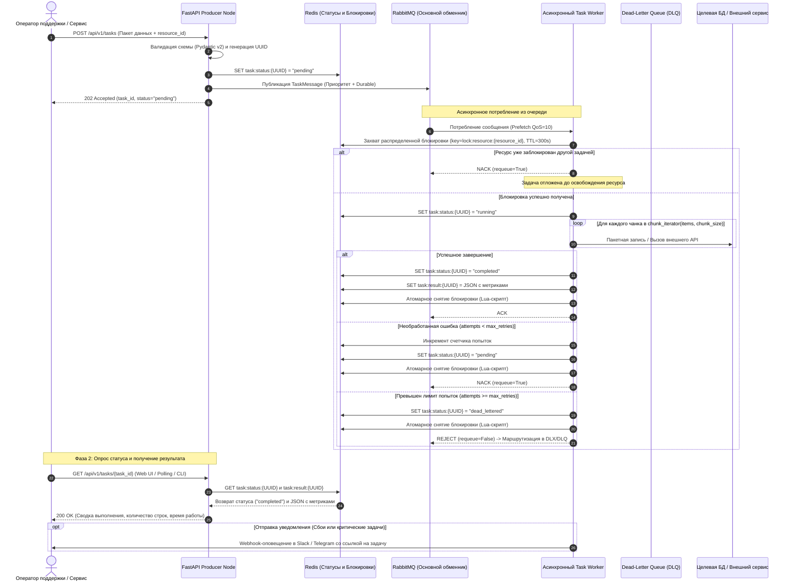

# Спецификация архитектуры системы

🌐 **[English](ARCHITECTURE.md)** • **[Русский](ARCHITECTURE_RU.md)**

В этом документе детально описаны архитектурные решения, ключевые инварианты, модели движения данных и технические компромиссы (trade-offs), реализованные в **Async Task Engine**

---

## 1. Архитектурные цели и ключевые принципы

Движок спроектирован для автоматизации операционной деятельности и внутренних платформ поддержки. Архитектура базируется на четырех ключевых инженерных принципах:

1. **Изолированное асинхронное исполнение:** Web API никогда не должен блокироваться на длительных задачах. Запросы валидируются, получают уникальный UUID, ставятся в очередь и моментально возвращают клиенту статус `202 Accepted`
2. **Потоковая обработка с ограничением памяти (Chunking):** Пакеты из сотен тысяч или миллионов записей не должны приводить к нехватке оперативной памяти (OOM). Обработка данных выполняется строго через генераторные потоки с константной сложностью по памяти `O(1)`
3. **Распределенный контроль конкурентности:** Операции, затрагивающие одну и ту же учетную запись или ресурс, должны выполняться строго последовательно. Гранулярные блокировки ресурсов исключают коллизии записей и гонки между несколькими воркерами
4. **Отказоустойчивая маршрутизация сбоев:** Сбойные задачи повторяются с учетом счетчика попыток. Задачи с неустранимыми ошибками изолируются в Dead-Letter Queue (DLQ), не блокируя обработку здоровых сообщений

---

## 2. Топология компонентов и поток данных



---

## 3. Детализация подсистем

### 3.1. Уровень продюсера (`src/api.py`)
- Построен на базе **FastAPI** с нативной асинхронной обработкой запросов
- Валидация входных структур выполняется через **Pydantic v2** (`src/schemas.py`)
- Публикация задач в direct exchange RabbitMQ с пулом соединений через `aio-pika`
- Жесткий SLA по времени ответа: прием задачи и постановка в очередь занимает менее 15 мс

### 3.2. Брокер очередей и топология AMQP (`src/broker.py`)
- **Direct Exchange (`tasks.direct`):** Маршрутизирует входящие задачи по ключу `task.process`
- **Основная очередь (`tasks_primary`):** Сконфигурирована с поддержкой приоритетов `x-max-priority=10` (уровни `low`, `normal`, `high`, `critical`) и параметром `x-dead-letter-exchange=tasks.dlx`
- **Dead-Letter Exchange (`tasks.dlx`) и очередь (`tasks_dead_letter`):** Перехватывают поврежденные сообщения и задачи с исчерпанными попытками для ручного разбора дежурным инженером

### 3.3. Менеджер распределенных блокировок (`src/redis_lock.py`)
- Защищает от параллельного исполнения задач над одним и тем же ресурсом (`resource_id`)
- Использует атомарную команду `SET lock:resource:{key} {token} NX EX {ttl}`
- Безопасное снятие блокировки с верификацией владельца через атомарный Lua-скрипт:

```lua
if redis.call("get", KEYS[1]) == ARGV[1] then
    return redis.call("del", KEYS[1])
else
    return 0
end
```
*Почему это важно:* Если задача выполнялась дольше назначенного TTL, блокировка автоматически снимется по тайм-ауту. Когда зависшая задача наконец завершится, скрипт на Lua проверит совпадение токена и не позволит случайно снять чужой новый лок, захваченный другим воркером

### 3.4. Движок потоковой обработки чанками (`src/chunker.py`)
- Отдает фиксированные срезы данных через генераторные итераторы
- Исключает копирование списков в памяти Python и устраняет длинные паузы сборщика мусора (GC)
- Обеспечивает стабильную пропускную способность при миграциях и пакетных обновлениях

### 3.5. Узел воркера (`src/worker.py`)
- Асинхронный цикл на базе `aio-pika` с ручным подтверждением обработки сообщений (`ack`, `nack`, `reject`)
- Перехват сигналов `signal.SIGINT` и `signal.SIGTERM` для корректного завершения активных задач перед остановкой контейнера (graceful shutdown)

### 3.6. Получение результатов и обратная связь для оператора
- **REST эндпоинт статуса:** Операторы опрашивают прогресс через `GET /api/v1/tasks/{task_id}`
- **Быстрое хранение состояния:** Воркер записывает метрики завершения в Redis (`task:result:{task_id}`), включая объект `TaskResult` (статус, обработанные элементы, количество чанков, время в секундах, стек ошибки)
- **Интеграция с Web UI:** Внутренние интерфейсы опрашивают статус до перехода в `COMPLETED` или `FAILED`, отображая live-прогресс
- **Проактивные алерты:** При фатальных сбоях отправляется webhook-сообщение в каналы дежурной смены (Telegram, Slack) с тегом инженера

### 3.7. Подсистема наблюдаемости и метрик (`src/metrics.py`)
- **Эндпоинт метрик:** Стандартный хэндлер `/metrics` в формате Prometheus exposition text
- **Счетчики пропускной способности:** `tasks_submitted_total` и `tasks_completed_total` с лейблами `task_type`, `priority` и `status`
- **Распределение задержек:** Гистограмма `task_duration_seconds` для расчета перцентилей p50, p95 и p99
- **Потоковые метрики:** `items_processed_total` отслеживает гранулярную скорость обработки отдельных строк
- **Здоровье очередей:** Метрика `dead_letter_tasks_total` и gauge `active_worker_tasks` для детекции зависания воркеров
- **CI/CD валидация:** GitHub Actions CI автоматически запускает тесты и проверку линтером на Python 3.11 и 3.12 при каждом push и PR

### 3.8. Веб-консоль управления для техподдержки (`src/static/`, `src/ops_api.py`)
- **Архитектура Single-Page:** Интерфейс на чистом Vanilla HTML5/CSS/JS с библиотекой Chart.js раздается напрямую из FastAPI без утяжеления сборками Node.js
- **Единый источник правды:** Эндпоинт `GET /api/v1/ops/overview` собирает данные напрямую из счетчиков Prometheus и Redis в реальном времени
- **Снятие зависших блокировок:** Инспекция активных локов с обратным отсчетом секунд и принудительным снятием через `POST /api/v1/ops/unlock`
- **Двусторонняя интеграция с DLQ:** Просмотр стектрейсов ошибок с возможностью повторной отправки задачи в основную очередь через `POST /api/v1/ops/dlq/replay`
- **Генерация отчетов об авариях:** Эндпоинт `POST /api/v1/ops/escalate` формирует структурированный Markdown-отчет (Incident Dossier) со всеми техническими параметрами для тикет-систем разработчиков

### 3.9. Подсистема идемпотентности и дедупликации (`src/schemas.py`, `src/api.py`)
- **Проблема в распределенной среде:** Нестабильность сети, повторные клики операторов и автоматические ретраи клиентов регулярно приводят к дублированию задач. Без дедупликации это вызывает повторные списания, двойную обработку записей и перегрузку воркеров
- **Два способа передачи ключа:** API поддерживает как стандартный HTTP-заголовок `Idempotency-Key`, так и поле в JSON-теле запроса `idempotency_key`
- **Атомарный кэш в Redis:** При поступлении запроса с токеном идемпотентности продюсер проверяет ключ `idempotency:{token}`:
  - **Попадание в кэш (Дубликат):** Продюсер блокирует отправку сообщения в RabbitMQ, логирует факт дедупликации и моментально возвращает сохраненный `TaskResponse` с исходным `task_id` и флагом `is_duplicate: true`
  - **Промах кэша (Новый запрос):** Формируется задача `TaskMessage` и публикуется в очередь. Связка `idempotency:{token} -> task_id` атомарно сохраняется в Redis с TTL 24 часа (`ex=86400`)
- **Защита нижележащих уровней:** Очереди RabbitMQ и фоновые воркеры полностью изолированы от дублирующей нагрузки

---

## 4. Архитектурные компромиссы и решения (Trade-Offs)

| Решение | Выбранный подход | Рассмотренная альтернатива | Обоснование / Trade-off |
|---|---|---|---|
| **Брокер сообщений** | RabbitMQ (`aio-pika`) | Apache Kafka, Celery | RabbitMQ обеспечивает точное ручное подтверждение доставки сообщений, нативную маршрутизацию в DLQ и приоритеты очередей без тяжелого оверхеда Celery |
| **Контроль конкурентности** | Распределенный лок в Redis | Блокировки строк в БД (`SELECT FOR UPDATE`) | Снимает нагрузку с пула соединений реляционной БД, предотвращая дефицит подключений при длительных операциях |
| **Дедупликация задач** | Кэш Redis с TTL (`idempotency:*`) | Таблицы уникальности в реляционной БД | Redis обеспечивает субмиллисекундную атомарную проверку ключа без нагрузки на дисковые IOPS реляционной базы при всплесках дублей |
| **Потоковая обработка** | Генераторные итераторы чанков | Загрузка массивов целиком, Pandas DataFrames | Генераторы гарантируют предсказуемое потребление памяти вне зависимости от размера входного набора данных |
| **Повторная обработка** | NACK с requeue и лимитом попыток | Бесконечные мгновенные ретраи | Предотвращает зависание очередей из-за "ядовитых" сообщений (poison pill) |
