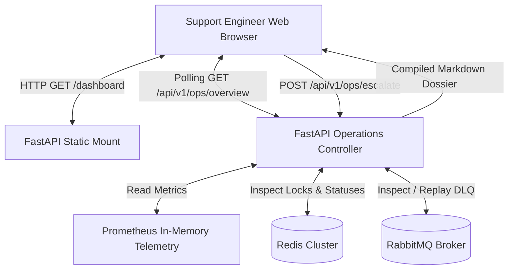

# Operations & Support Web Console Operator Guide

**Service:** `async-task-engine`  
**Access URL:** `http://localhost:8000/dashboard`  
**Target Audience:** L2/L3 Support Engineers, SREs, System Operators, On-Call Backend Developers  
**Author:** [George Ladd](https://github.com/georgeladd)

---

## 1. Overview & Architecture

The Operations & Support Web Console provides real-time operational visibility, telemetry charts, distributed lock management, Dead-Letter Queue (DLQ) triage, and automated incident compilation for the `async-task-engine` ecosystem



### Architectural Principles
- **Zero Node.js Build Pipeline:** Implemented using pure Vanilla HTML5, CSS3, and JavaScript with Chart.js loaded via CDN; requires no Webpack, Vite, or Node daemon
- **Single Source of Truth:** Telemetry values match Prometheus `/metrics` gauges and Redis cluster state with sub-second accuracy
- **Safe Administrative Controls:** Destructive or mutating operations (lock removal, DLQ replay) require browser confirmation dialogs to prevent accidental production impact

---

## 2. Global Header & System Status Bar

Located at the top of every console view, the header provides instant cluster health state and administrative shortcuts

### 2.1. System Health Indicators
| Indicator | Healthy State | Degraded State | Operator Immediate Action |
|---|---|---|---|
| **API** | `OK` (Green dot) | `Offline` (Red pulse) | Check container logs: `docker logs async-engine-api` |
| **RabbitMQ** | `Active` (Green dot) | `Down` (Red pulse) | Verify AMQP port 5672: `rabbitmqctl status` |
| **Redis** | `Online` (Green dot) | `Unavailable` (Red pulse) | Verify Redis connection: `redis-cli ping` |
| **Workers** | `N in-flight` | `0 in-flight` with backlog > 0 | Workers stalled; restart pool: `docker-compose restart worker` |

### 2.2. Header Controls
- **Auto-Refresh Selector:** Configurable polling cadence (`Every 3s`, `Every 5s`, `Every 10s`, or `Manual`). Default is set to 5 seconds
- **`⟳ Refresh` Button:** Forces an immediate fetch of telemetry, locks, and DLQ status without waiting for the timer
- **`🚨 Create Incident` Button:** Global emergency shortcut to open the Incident Escalation modal for any customer-reported Task UUID

---

## 3. Real-Time KPI Cards

Four primary KPI cards visualize system load and processing health at a glance:

1. **Queue Backlog (`#kpi-queue-depth`):**
   - Number of tasks currently enqueued in the primary RabbitMQ exchange awaiting worker pick-up
   - *Healthy Range:* 0 to 50 tasks during normal operations
   - *Alarm Threshold:* > 500 tasks accumulating with zero active workers
2. **In-Flight Tasks (`#kpi-in-flight`):**
   - Active worker executions currently processing chunks and holding distributed Redis resource locks
3. **Completed Tasks & Items (`#kpi-completed`):**
   - Lifetime count of successfully acknowledged tasks and cumulative individual data records processed across all chunk streams
4. **Dead-Letter Queue (`#kpi-dlq`):**
   - Number of tasks that exceeded retry limits (`max_task_retries = 3`) and were routed to the Dead-Letter Queue
   - Highlighted in red whenever greater than 0

---

## 4. Operational Telemetry Charts

The console renders dynamic live-updating canvas charts driven by Chart.js:

- **Throughput & Queue Trends:** Displays dual time-series lines tracking completed tasks versus incoming queue backlog over rolling polling cycles
- **Batch Processing Duration Histogram:** Segregates execution latencies into buckets (`< 0.1s`, `0.5s`, `1.0s`, `2.5s`, `5.0s`, `> 10s`) with live average latency calculations

---

## 5. Active Distributed Locks Management

Located in the left panel under the charts, this table displays every resource key currently guarded against concurrent writes:

| Field | Description |
|---|---|
| **Resource ID** | The unique tenant or resource partition key being updated |
| **TTL Remaining** | Seconds remaining before Redis automatically evicts the lock if the worker crashes |
| **Owner Token** | Truncated UUID ownership token used by atomic Lua release scripts |
| **Action** | Red `🔓 Force Unlock` button |

### How to Safely Release a Stuck Lock
1. Verify whether the worker holding the lock has crashed or is stalled in a downstream deadlock
2. Click **`🔓 Force Unlock`**
3. Accept the browser confirmation prompt (`Are you sure you want to release the lock on '...'?`)
4. The console sends a `POST /api/v1/ops/unlock` request and displays a confirmation notification toast

---

## 6. Self-Service Operational Task Runner

The right-hand panel enables support engineers to trigger standard administrative jobs without CLI terminal access:

1. **Task Type:** Select between standard remediation handlers (`data_cleanup`, `cache_warmup`, `inventory_sync`)
2. **Target Resource Key:** Input the resource identifier (e.g. `tenant_production_912`)
3. **Priority:** Choose dispatch priority (`normal`, `high`, `critical`, `low`)
4. **Batch Items:** Number of mock records to process (1 to 5,000 items)
5. **Dispatch:** Click **`🚀 Dispatch Task`**. The system returns `202 Accepted`, displays the assigned UUID, and live metrics update automatically

---

## 7. Dead-Letter Queue (DLQ) Triage & Recovery

Located at the bottom of the console, the DLQ panel lists every failed task that could not be completed after maximum retries:

### Available Actions per Failed Task
- **Inspect Error:** Review the root cause exception and error string in the *Failure Root Cause* column
- **`⟲ Replay`:** Re-enqueues the task back into the primary queue with high priority via `POST /api/v1/ops/dlq/replay`
- **`🚨 Escalate`:** Opens the Incident Dossier modal pre-filled with this task UUID

---

## 8. Incident Escalation & Engineering Dossier Generation

When an issue requires backend developer investigation, support can generate a complete Markdown dossier in seconds

### 8.1. Workflow A: Global Escalation (From Header)
1. In the top right header, click **`🚨 Create Incident`**
2. Paste the customer's `Task UUID` (e.g. `550e8400-e29b-41d4-a716-446655440000`) into the **Target Task UUID** field
3. In **Operator Observations**, type relevant context (e.g. *"Customer reports batch export stalled at 85% after schema update"*)
4. Click **Generate Incident Dossier**
5. Click **`📋 Copy Dossier to Clipboard`** and paste into Jira, GitHub Issues, or Slack

### 8.2. Workflow B: Contextual Escalation (From DLQ Row)
1. Locate the failing task in the DLQ table
2. Click **`🚨 Escalate`** in the *Actions* column
3. The modal opens with the Task UUID pre-populated
4. Add operator notes and click **Generate Incident Dossier**

### 8.3. Format of the Generated Dossier
````markdown
### Incident Report: INC-A4B92C1D
**Service:** async-task-engine
**Timestamp:** 2026-09-10 10:15:00 UTC
**Target Task UUID:** `550e8400-e29b-41d4-a716-446655440000`
**Current Status:** `DEAD_LETTERED`

#### Diagnostic Context
- **Environment:** `production`
- **RabbitMQ Main Queue:** `tasks.primary`
- **Dead-Letter Queue:** `tasks.dead_letter`
- **Runtime Diagnostics:**
```text
psycopg2.OperationalError: server closed the connection unexpectedly
```

#### Operator Observations (L2 Support)
> Customer reports export stalled after initiating custom column filtering

#### Recommended Immediate Actions (L3 / Dev)
1. Inspect payload format against active database schemas
2. Verify downstream database connection pool saturation
3. After patch deployment, execute replay via POST /api/v1/ops/dlq/replay
````

---

## 9. Operator Incident Matrix & Rapid Triage

| Symptom in Console | Probable Root Cause | Operator Action |
|---|---|---|
| **Backlog increasing, Workers = 0** | Worker process died or disconnected from RabbitMQ | Run `docker-compose restart worker` |
| **Resource permanently locked, TTL not expiring** | Worker crashed mid-execution without releasing lock | Verify worker logs, then click `🔓 Force Unlock` |
| **Tasks appearing in DLQ** | Poison pill message or upstream API failure | Inspect failure message, fix upstream condition, then click `⟲ Replay` |
| **Average duration spike (> 5s)** | Downstream DB slow queries or network latency | Inspect database load; throttle worker rate via `RATE_LIMIT_PER_SECOND` |
