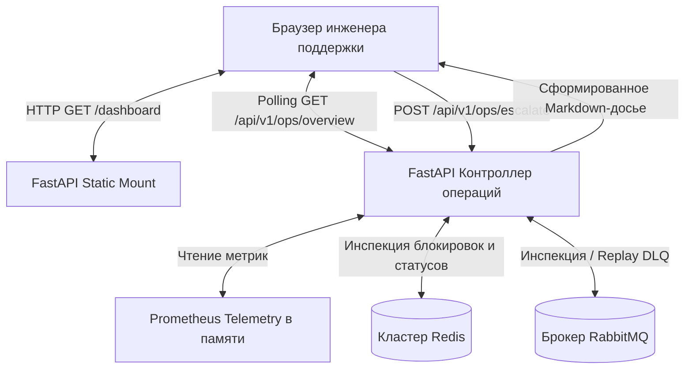

# Руководство оператора по веб-консоли управления и поддержки

**Сервис:** `async-task-engine`  
**Адрес консоли:** `http://localhost:8000/dashboard`  
**Целевая аудитория:** Инженеры поддержки L2/L3, SRE, системные операторы, дежурные разработчики  
**Автор:** [George Ladd](https://github.com/georgeladd)

---

## 1. Обзор консоли и архитектура

Веб-консоль управления предоставляет оперативный мониторинг очередей, графики телеметрии в реальном времени, управление распределенными блокировками Redis, разбор аварийной очереди Dead-Letter Queue (DLQ) и автоматизированную генерацию отчетов об инцидентах для команды разработки



### Архитектурные принципы
- **Никаких сборок Node.js:** Реализовано на чистом Vanilla HTML5, CSS3 и JavaScript с библиотекой Chart.js; не требует сборщиков Webpack, Vite и фоновых процессов Node.js
- **Единый источник правды:** Значения телеметрии точно соответствуют счетчикам Prometheus `/metrics` и состоянию ключей в Redis с субсекундной задержкой
- **Безопасность административных действий:** Операции снятия блокировок и повторного запуска из DLQ защищены диалоговыми окнами подтверждения в браузере

---

## 2. Панель статуса системы и глобальное управление (Header)

Верхняя панель навигации доступна на любой странице дашборда и отображает моментальное состояние компонентов кластера

### 2.1. Индикаторы работоспособности сервисов
| Индикатор | Нормальное состояние | Аварийное состояние | Немедленное действие оператора |
|---|---|---|---|
| **API** | `OK` (Зеленая точка) | `Offline` (Красный пульс) | Проверить логи контейнера: `docker logs async-engine-api` |
| **RabbitMQ** | `Active` (Зеленая точка) | `Down` (Красный пульс) | Проверить порт AMQP 5672: `rabbitmqctl status` |
| **Redis** | `Online` (Зеленая точка) | `Unavailable` (Красный пульс) | Проверить отклик Redis: `redis-cli ping` |
| **Workers** | `N in-flight` | `0 in-flight` при очереди > 0 | Пул воркеров завис; перезапустить: `docker-compose restart worker` |

### 2.2. Кнопки управления в шапке
- **Выбор интервала обновления:** Выпадающий список (`Every 3s`, `Every 5s`, `Every 10s` или `Manual`). По умолчанию установлено 5 секунд
- **Кнопка `⟳ Refresh`:** Принудительно обновляет все метрики, список локов и задачи DLQ, не дожидаясь таймера
- **Кнопка `🚨 Create Incident`:** Глобальная кнопка быстрого создания отчета об аварии по любому `Task UUID`, переданному клиентом

---

## 3. Карточки ключевых показателей (KPI Cards)

Четыре информационные карточки позволяют мгновенно оценить нагрузку и состояние обработки:

1. **Queue Backlog (`#kpi-queue-depth`):**
   - Количество задач, ожидающих обработки в первичной очереди RabbitMQ
   - *Норма:* от 0 до 50 задач при стабильном потоке
   - *Тревога:* более 500 задач при отсутствии активных воркеров
2. **In-Flight Tasks (`#kpi-in-flight`):**
   - Количество задач, выполняемых воркерами прямо сейчас и удерживающих распределенную блокировку ресурса в Redis
3. **Completed Tasks & Items (`#kpi-completed`):**
   - Общее число успешно завершенных задач и суммарное количество обработанных записей во всех потоках чанков
4. **Dead-Letter Queue (`#kpi-dlq`):**
   - Количество задач, упавших в аварийную очередь после исчерпания 3 попыток выполнения (`max_task_retries = 3`)
   - Подсвечивается красным цветом, если значение больше 0

---

## 4. Графики телеметрии в реальном времени

Дашборд отображает два динамических графика на базе Chart.js:

- **Throughput & Queue Trends:** Двухлинейный график, сопоставляющий скорость завершения задач с глубиной входящей очереди во времени
- **Batch Processing Duration Histogram:** Гистограмма распределения времени выполнения пакетов по корзинам (`< 0.1s`, `0.5s`, `1.0s`, `2.5s`, `5.0s`, `> 10s`) с расчетом среднего времени обработки

---

## 5. Управление распределенными блокировками Redis

Левая панель под графиками отображает список всех ресурсов, защищенных от состояний гонки:

| Колонка | Назначение |
|---|---|
| **Resource ID** | Уникальный ключ сущности или клиента (tenant key), над которым идет операция |
| **TTL Remaining** | Обратный отсчет секунд до автоматического удаления блокировки при падении воркера |
| **Owner Token** | Сокращенный UUID токена владения, используемый Lua-скриптом для атомарного снятия |
| **Action** | Красная кнопка `🔓 Force Unlock` |

### Регламент безопасного снятия зависшей блокировки
1. Убедись по логам воркера, что процесс обработки действительно упал или завис
2. Нажми кнопку **`🔓 Force Unlock`** напротив нужного ресурса
3. Подтверди действие во всплывающем окне браузера
4. Система отправит запрос `POST /api/v1/ops/unlock` и отобразит уведомление об успешном снятии

---

## 6. Панель самообслуживания саппорта (Task Runner)

Правая панель позволяет инженерам поддержки запускать стандартные сервисные операции без необходимости использовать терминал и curl:

1. **Task Type:** Выбери тип задачи (`data_cleanup`, `cache_warmup`, `inventory_sync`)
2. **Target Resource Key:** Укажи идентификатор целевого ресурса (например `tenant_account_402`)
3. **Priority:** Выбери приоритет выполнения (`normal`, `high`, `critical`, `low`)
4. **Batch Items:** Количество генерируемых записей для обработки (от 1 до 5000)
5. **Запуск:** Нажми **`🚀 Dispatch Task`**. Сервис вернет статус `202 Accepted`, покажет присвоенный UUID и обновит счетчики очередей

---

## 7. Разбор аварийной очереди Dead-Letter Queue (DLQ)

Нижняя панель содержит список задач, которые не удалось выполнить после 3 автоматических повторов:

### Доступные действия
- **Анализ причины сбоя:** Текст ошибки и стек-трейс отображаются в колонке *Failure Root Cause*
- **Кнопка `⟲ Replay`:** Повторно отправляет задачу в основную очередь с высоким приоритетом через `POST /api/v1/ops/dlq/replay`
- **Кнопка `🚨 Escalate`:** Открывает окно формирования досье инцидента с уже предзаполненным UUID этой задачи

---

## 8. Создание отчета об инциденте (Incident Dossier)

Если сбой требует вмешательства разработчиков L3, оператор может сформировать исчерпывающий отчет в Markdown за несколько секунд

### 8.1. Сценарий A: Создание инцидента через верхнюю кнопку (Глобальный)
1. В правом верхнем углу дашборда нажми красную кнопку **`🚨 Create Incident`**
2. Вставь `Task UUID` задачи, полученный от клиента (например `550e8400-e29b-41d4-a716-446655440000`)
3. В поле **Operator Observations** введи описание контекста (например *"Клиент жалуется на зависание выгрузки на 85% после обновления структуры каталога"*)
4. Нажми **Generate Incident Dossier**
5. Нажми зеленую кнопку **`📋 Copy Dossier to Clipboard`** и вставь отчет в задачу Jira или инцидентный чат разработки

### 8.2. Сценарий B: Эскалация упавшей задачи из таблицы DLQ (Контекстный)
1. Найди проблемную задачу в нижней таблице DLQ
2. Нажми кнопку **`🚨 Escalate`** в колонке *Actions*
3. UUID задачи подставится в форму автоматически
4. Добавь комментарий оператора и нажми **Generate Incident Dossier**

### 8.3. Пример сформированного отчета (Incident Dossier)
````markdown
### Incident Report: INC-A4B92C1D
**Service:** async-task-engine
**Timestamp:** 2026-09-10 10:15:00 UTC
**Target Task UUID:** `550e8400-e29b-41d4-a716-446655440000`
**Current Status:** `DEAD_LETTERED`

#### Diagnostic Context
- **Environment:** `production`
- **RabbitMQ Main Queue:** `tasks.primary`
- **Dead-Letter Queue:** `tasks.dead_letter`
- **Runtime Diagnostics:**
```text
psycopg2.OperationalError: server closed the connection unexpectedly
```

#### Operator Observations (L2 Support)
> Клиент жалуется на зависание выгрузки на 85% после обновления структуры каталога

#### Recommended Immediate Actions (L3 / Dev)
1. Inspect payload format against active database schemas
2. Verify downstream database connection pool saturation
3. After patch deployment, execute replay via POST /api/v1/ops/dlq/replay
````

---

## 9. Матрица оперативного реагирования на типовые инциденты

| Симптом на дашборде | Вероятная причина | Действие дежурного инженера |
|---|---|---|
| **Растет очередь, воркеры = 0** | Процесс воркера упал или потерял связь с RabbitMQ | Выполнить `docker-compose restart worker` |
| **Ресурс заблокирован, TTL не убывает** | Воркер упал в середине обработки, не освободив лок | Проверить логи воркера, нажать `🔓 Force Unlock` |
| **Появление задач в таблице DLQ** | Ошибка валидации данных или недоступность стороннего сервиса | Изучить текст ошибки, устранить внешнюю проблему, нажать `⟲ Replay` |
| **Резкий рост среднего времени (> 5s)** | Медленные запросы к БД или дефицит сетевого канала | Проверить нагрузку на базу; ограничить напор через `RATE_LIMIT_PER_SECOND` |
